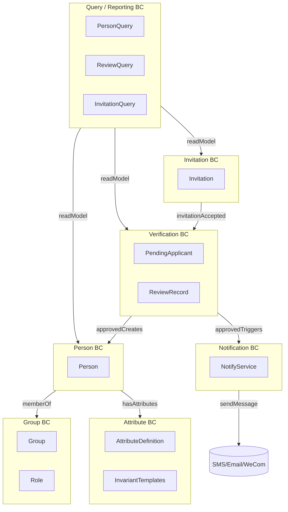

```mermaid
graph TD

subgraph PersonBC[Person BC]
  Person
end

subgraph VerificationBC[Verification BC]
  PendingApplicant
  ReviewRecord
end

subgraph InvitationBC[Invitation BC]
  Invitation
end

subgraph GroupBC[Group BC]
  Group
  Role
end

subgraph AttributeBC[Attribute BC]
  AttributeDefinition
  InvariantTemplates
end

subgraph QueryBC[Query / Reporting BC]
  PersonQuery
  ReviewQuery
  InvitationQuery
end

subgraph NotificationBC[Notification BC]
  NotifyService
end

%% Connections
InvitationBC -- invitationAccepted --> VerificationBC
VerificationBC -- approvedCreates --> PersonBC
VerificationBC -- approvedTriggers --> NotificationBC
PersonBC -- memberOf --> GroupBC
PersonBC -- hasAttributes --> AttributeBC

QueryBC -- readModel --> PersonBC
QueryBC -- readModel --> VerificationBC
QueryBC -- readModel --> InvitationBC

NotificationBC -- sendMessage --> ExternalChannels[(SMS/Email/WeCom)]

```
