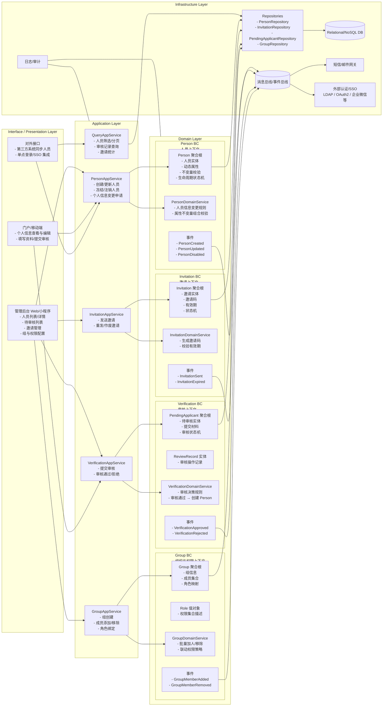

```mermaid
graph LR

subgraph Interface[Interface / Presentation Layer]
  AdminUI[管理后台 Web/小程序\n- 人员列表/详情\n- 待审核列表\n- 邀请管理\n- 组与权限配置]
  MobileUI[门户/移动端\n- 个人信息查看与编辑\n- 填写资料/提交审核]
  OpenAPI[对外接口\n- 第三方系统同步人员\n- 单点登录/SSO 集成]
end

subgraph Application[Application Layer]
  PersonAppService[PersonAppService\n- 创建/更新人员\n- 冻结/注销人员\n- 个人信息变更申请]
  InvitationAppService[InvitationAppService\n- 发送邀请\n- 重发/作废邀请]
  VerificationAppService[VerificationAppService\n- 提交审核\n- 审核通过/拒绝]
  GroupAppService[GroupAppService\n- 组创建\n- 成员添加/移除\n- 角色绑定]
  QueryAppService[QueryAppService\n- 人员筛选/分页\n- 审核记录查询\n- 邀请统计]
end

subgraph Domain[Domain Layer]
  subgraph PersonBC[Person BC\n人员上下文]
    PersonAgg[Person 聚合根\n- 人员实体\n- 动态属性\n- 不变量校验\n- 生命周期状态机]
    PersonDomainService[PersonDomainService\n- 人员信息变更规则\n- 属性不变量组合校验]
    PersonEvents[事件\n- PersonCreated\n- PersonUpdated\n- PersonDisabled]
  end

  subgraph InvitationBC[Invitation BC\n邀请上下文]
    InvitationAgg[Invitation 聚合根\n- 邀请实体\n- 邀请码\n- 有效期\n- 状态机]
    InvitationDomainService[InvitationDomainService\n- 生成邀请码\n- 校验有效期]
    InvitationEvents[事件\n- InvitationSent\n- InvitationExpired]
  end

  subgraph VerificationBC[Verification BC\n审核上下文]
    PendingPersonAgg[PendingApplicant 聚合根\n- 待审核实体\n- 提交材料\n- 审核状态机]
    ReviewRecordAgg[ReviewRecord 实体\n- 审核操作记录]
    VerificationDomainService[VerificationDomainService\n- 审核决策规则\n- 审核通过 → 创建 Person]
    VerificationEvents[事件\n- VerificationApproved\n- VerificationRejected]
  end

  subgraph GroupBC[Group BC\n组织与权限上下文]
    GroupAgg[Group 聚合根\n- 组信息\n- 成员集合\n- 角色映射]
    RoleVO[Role 值对象\n- 权限集合描述]
    GroupDomainService[GroupDomainService\n- 批量加人/移除\n- 联动权限策略]
    GroupEvents[事件\n- GroupMemberAdded\n- GroupMemberRemoved]
  end
end

subgraph Infra[Infrastructure Layer]
  Repositories[Repositories\n- PersonRepository\n- InvitationRepository\n- PendingApplicantRepository\n- GroupRepository]
  DB[(Relational/NoSQL DB)]
  MessageBus[(消息总线/事件总线)]
  SMSGateway[短信/邮件网关]
  ExternalAuth[外部认证/SSO\nLDAP / OAuth2 / 企业微信等]
  Logger[日志/审计]
end

AdminUI --> PersonAppService
AdminUI --> InvitationAppService
AdminUI --> VerificationAppService
AdminUI --> GroupAppService
MobileUI --> PersonAppService
MobileUI --> VerificationAppService
OpenAPI --> PersonAppService
OpenAPI --> QueryAppService

PersonAppService --> PersonAgg
PersonAppService --> PersonDomainService
InvitationAppService --> InvitationAgg
InvitationAppService --> InvitationDomainService
VerificationAppService --> PendingPersonAgg
VerificationAppService --> VerificationDomainService
GroupAppService --> GroupAgg
GroupAppService --> GroupDomainService
QueryAppService --> Repositories

PersonAgg --> Repositories
InvitationAgg --> Repositories
PendingPersonAgg --> Repositories
GroupAgg --> Repositories

PersonEvents --> MessageBus
InvitationEvents --> MessageBus
VerificationEvents --> MessageBus
GroupEvents --> MessageBus

MessageBus --> SMSGateway
MessageBus --> ExternalAuth
Repositories --> DB
Logger --- Application
Logger --- Domain

```
