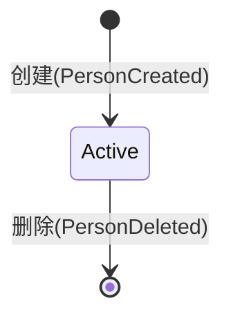
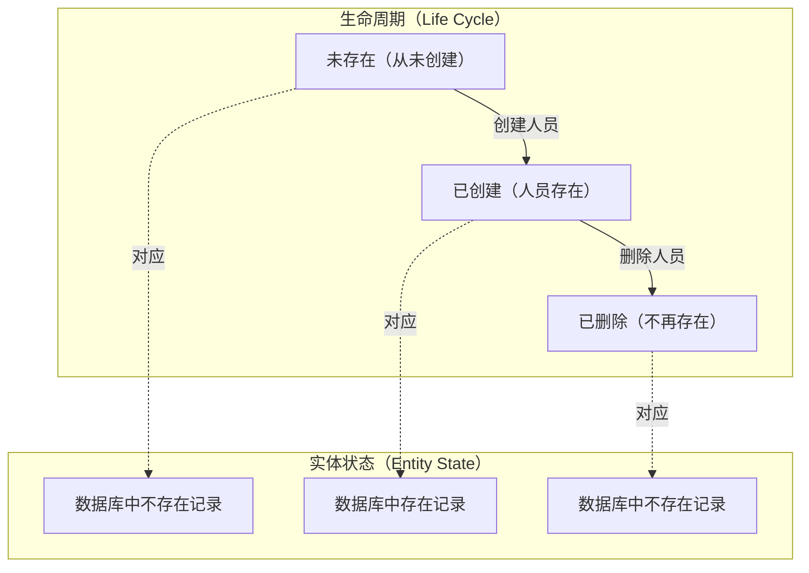

## 人员实体状态机

```mermaid
stateDiagram-v2
    [*] --> Active: 创建(PersonCreated)
    Active --> [*]: 删除(PersonDeleted)
```

## 双层模型

```mermaid
flowchart TD

subgraph LC["生命周期（Life Cycle）"]
    LC_NotExist["未存在（从未创建）"]
    LC_Active["已创建（人员存在）"]
    LC_Removed["已删除（不再存在）"]
end

LC_NotExist -->|创建人员| LC_Active
LC_Active -->|删除人员| LC_Removed

subgraph ES["实体状态（Entity State）"]
    ES_None1["数据库中不存在记录"]
    ES_Active["数据库中存在记录"]
    ES_None2["数据库中不存在记录"]
end

LC_NotExist -. 对应 .-> ES_None1
LC_Active   -. 对应 .-> ES_Active
LC_Removed  -. 对应 .-> ES_None2

```
