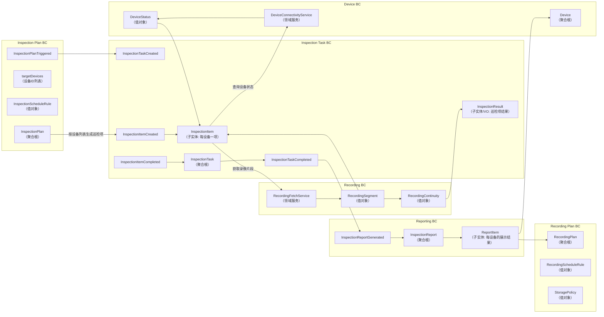
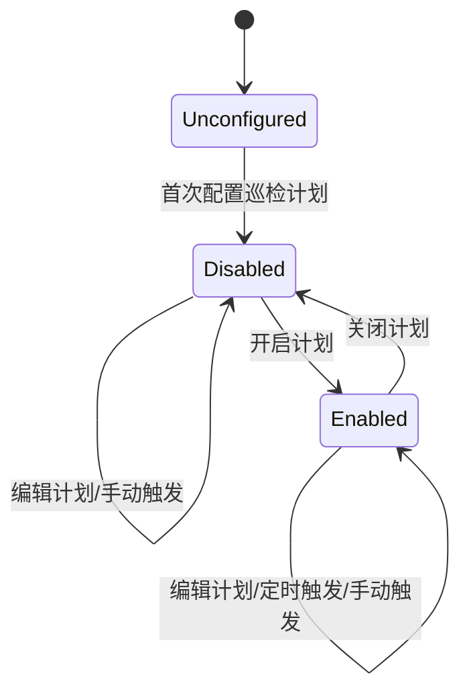
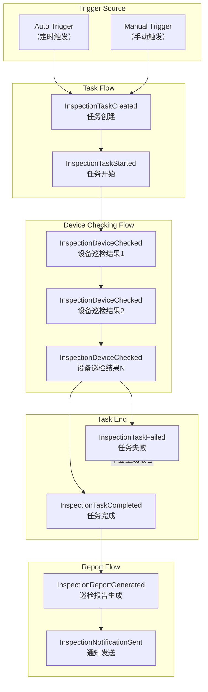
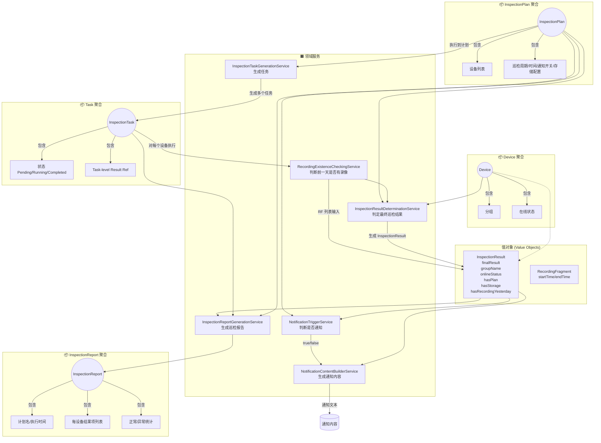

# 录像巡检计划的生命周期状态图

# 录像巡检事件流

## 事件相关测试点

2. InspectionTaskStarted —（任务开始执行事件）
到达调度执行时间后 ← 状态变为 Running
手动点击“立即巡检”后 ← 状态变为 Running
任务开始时间被填入
任务详情页显示“执行中”
能看到设备检查进度（n / total）

3. InspectionDeviceChecked —（单设备巡检完成事件）
每当一个设备巡检结束，任务状态更新
成功巡检 → 显示“正常”
异常巡检 → 显示“异常 + 原因”

4. InspectionTaskCompleted —（任务完成事件）

报告入口可点击，UI 上可查看完整任务结果

5. InspectionTaskFailed —（任务失败事件）
服务不可访问 → 任务进入 Failed
巡检计划找不到 → 任务直接 Failed

6. InspectionReportGenerated —（报告生成事件）
- 任务完成后，应生成完整报告

报告中包含：
全部设备巡检结果
正常数量、异常数量、正常率
无录像计划数量
设备分组、在线状态展示

- 任务为 Failed → 不应生成报告
- 任务只有部分设备结果 → 不生成报告

7. InspectionNotificationSent —（通知已发送事件）

若通知开关开启 → 在报告生成后发送通知
邮件模板正确替换参数（任务ID、正常率等）
SMS 模板正确替换参数
用户邮箱/短信收到通知

8. 手动触发录像巡检生效性验证；定时触发录像巡检生效性验证。

# 事件相关测试的抽象方法

事件维度的系统测试点来源于事件的三个要素：
“事件何时触发（When）——事件触发条件”
“事件携带什么信息（What）——事件输出/载荷”
“事件导致什么后果（Effect）——事件副作用/后续行为”

事件测试点 = Trigger × Payload × Effect × Non-occurrence（不发生）

- 满足触发条件时，事件是否发生
- 不满足触发条件时，事件是否不发生
- 事件携带的数据是否正确传播
- 事件流是否按因果关系发生

# 录像巡检领域流程图

