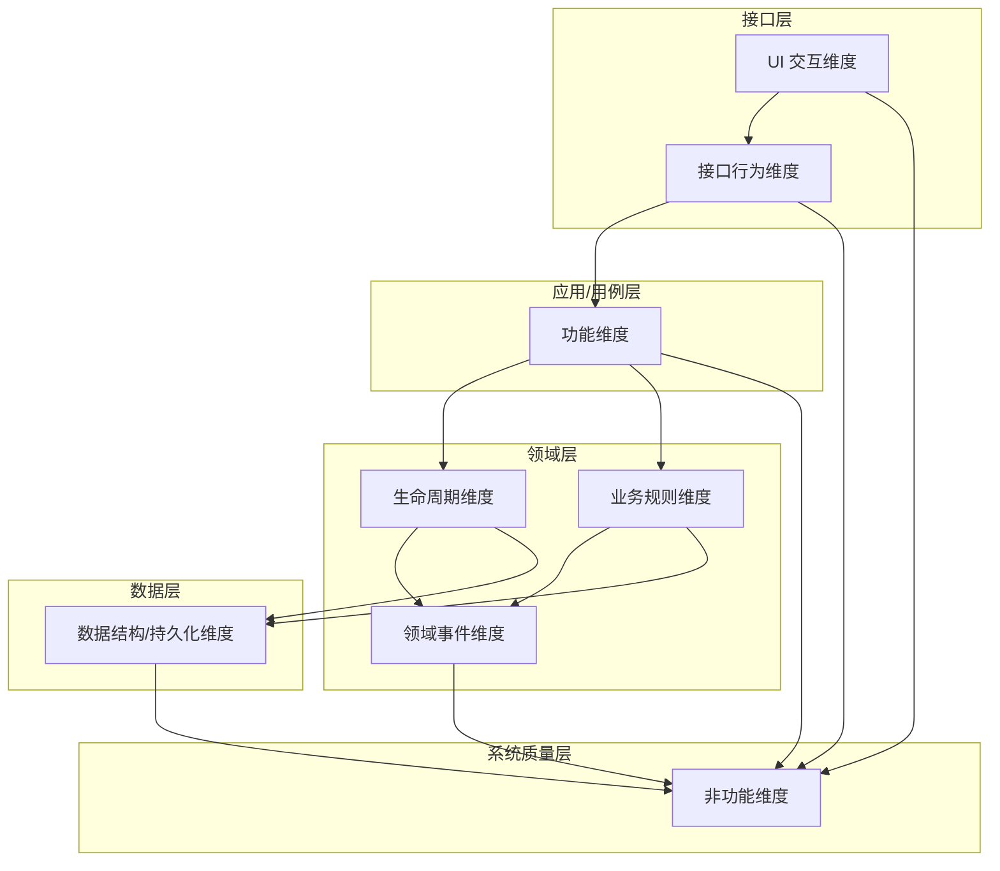

```mermaid
graph TD

subgraph InterfaceLayer[接口层]
  UI[UI 交互维度]
  API[接口行为维度]
end

subgraph AppLayer[应用/用例层]
  FR[功能维度]
end

subgraph DomainLayer[领域层]
  LC[生命周期维度]
  BR[业务规则维度]
  DE[领域事件维度]
end

subgraph DataLayer[数据层]
  DATA[数据结构/持久化维度]
end

subgraph SystemLayer[系统质量层]
  NFR[非功能维度]
end

%% 关系

UI --> API
API --> FR

FR --> LC
FR --> BR
LC --> DE
BR --> DE

LC --> DATA
BR --> DATA

FR --> NFR
API --> NFR
DATA --> NFR

UI --> NFR
DE --> NFR

```
