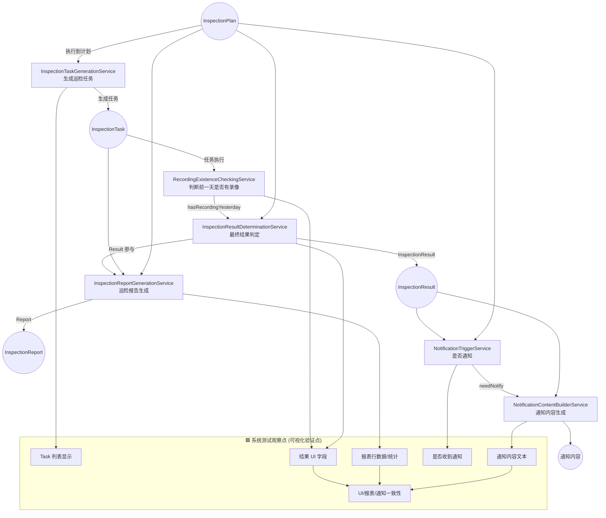

## 领域服务的概念

当某个领域行为无法被自然地放入任何实体或值对象中时，为了保持领域模型的纯净与一致性，将该行为以领域语言形式表述并封装在一个无状态的领域对象中，这个对象就是领域服务。

换句话说：

- 它是“业务行为的载体”，而不是“数据的载体”
- 它存在是为了承担跨实体、跨聚合、跨值对象的业务计算或业务规则
- 它不是应用服务


## 领域服务的特征

领域服务具有以下特征：

- 无状态
- 跨实体/跨聚合的业务规则
- 体现业务能力，而非技术能力
- 接受输入 → 应用领域规则 → 输出结果（或驱动状态变化）

## 领域服务VS实体行为

- 放在实体的行为必须满足：
  - 行为只依赖该实体自身的数据
  - 行为能自然被描述为“这个实体能够做某事”

- 如果满足以下情况，就不应该放实体：
  - 行为依赖多个实体
  - 行为更像“规则”而不是“对象行为”
  - 行为执行结果对多个聚合有影响
  - 行为不自然描述为“某个对象去做某事”

## 领域服务的测试重点
领域服务的测试重点不在 UI，而在：
- 规则
- 行为
- 作用
- 数据一致性

## 系统测试领域服务流程

```text
[1] 业务场景整理
        ↓
[2] 场景关联的领域服务映射
        ↓
[3] 提取每个领域服务的外部“可观察点”
        ↓
[4] 映射到 UI/API/通知等可视位置
        ↓
[5] 合并重复观察点（去重）
        ↓
[6] 按场景撰写 GWT 系统测试用例
        ↓
[7] 做跨服务一致性验证
        ↓
[8] 回溯需求确保覆盖
        ↓
[9] 回溯领域模型确保覆盖不遗漏

```

## 领域服务的案例

| 领域服务                                     | 核心功能       | 输入                                    | 输出               |
| ---------------------------------------- | ---------- | ------------------------------------- | ---------------- |
| **InspectionTaskGenerationService**      | 生成巡检任务     | Plan + Devices + Time                 | 多个 Task（Pending） |
| **RecordingExistenceCheckingService**    | 判断前一天是否有录像 | 录像片段列表                                | Boolean          |
| **InspectionResultDeterminationService** | 得到最终巡检结果   | Plan + Device + hasRecordingYesterday | InspectionResult |
| **NotificationTriggerService**           | 判断是否需要通知   | Plan.notificationEnabled + Result     | Boolean          |
| **NotificationContentBuilderService**    | 根据模板生成通知内容 | Result + 模板                           | 文本内容             |

## 录像巡检领域服务流程和可观察点



## 领域服务相关测试点
1. 领域规则验证，通过可视行为表现验证
2. 领域行为的结果验证。

### InspectionTaskGenerationService
#### 领域规则
- 计划未启用 → 不生成任务
- 到达执行时间 → 执行
- 周期规则（每天/每两天/每周）
- 设备列表为空 → 不生成

### RecordingExistenceCheckingService
#### 领域规则
- 0 段 → 无录像
- ≥1 段 → 有录像
- 跨天规则

### InspectionResultDeterminationService
#### 领域规则
巡检结果：
- 无计划 
- 无存储 
- 无录像 
- 全部正常
- 上述情况组合

#### 结果与不变量
录像状态、设备分组、在线状态保存到结果

### NotificationTriggerService
#### 领域规则
- 开关开启 → 通知
- 开关关闭 → 不通知

### NotificationContentBuilderService
#### 领域规则
- 模板字段变量必须被替换
