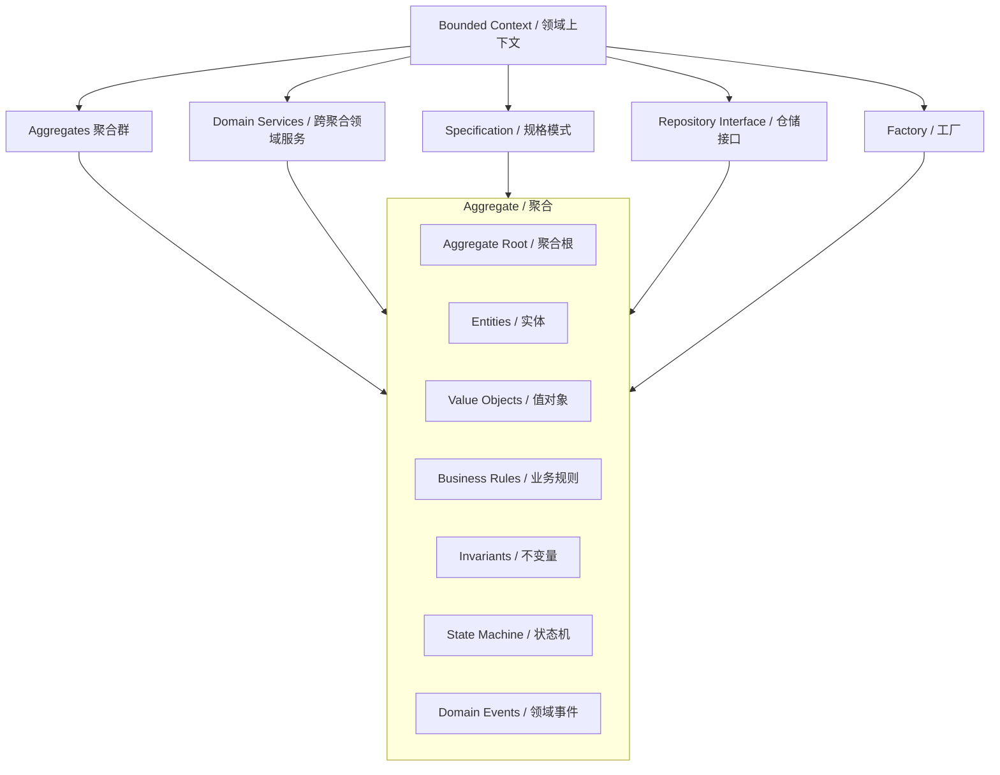
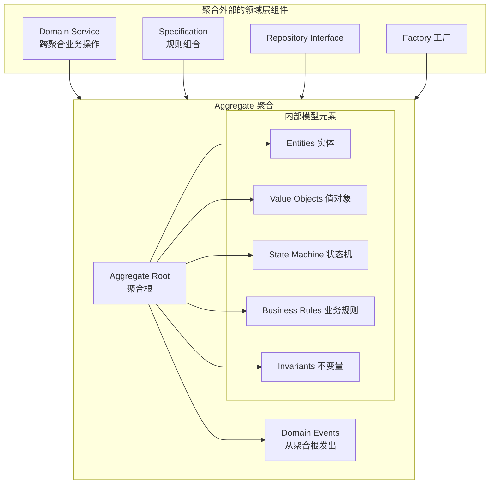
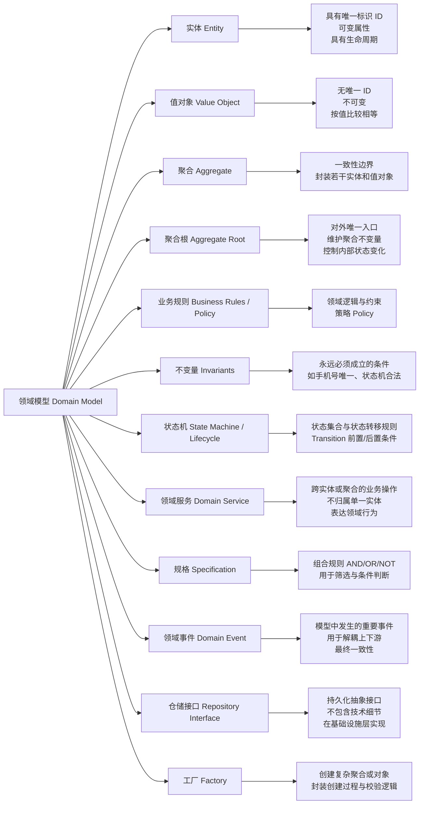
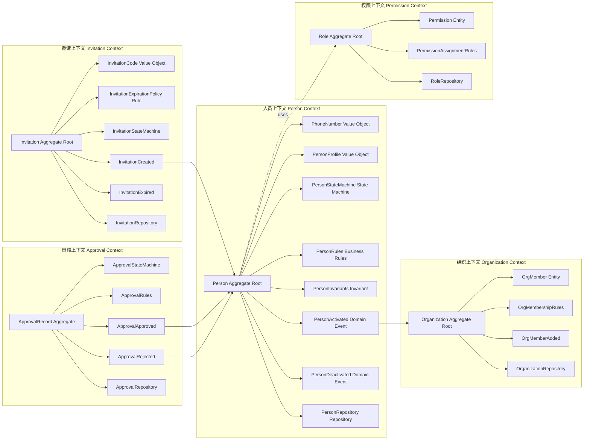

# 界限上下文

界限上下文是一块清晰划定边界的业务语义范围，在这个范围内，模型的术语、实体、业务规则、状态含义都具有严格的一致性，不与外部混淆。
一个上下文 = 一个业务语言宇宙。

## 划分依据

- 规则自洽
- 完成独立职责
- 模型自洽
- 状态机自洽
- 生命周期自洽
- 语义隔离
- 业务概念不冲突

## 领域模型结构图

```mermaid
flowchart TB

    %% ========== 上下文 ==========
    A[Bounded Context / 领域上下文] --> B[Aggregates 聚合群]

    %% ========== 聚合 ==========
    subgraph AGG[Aggregate / 聚合]
        AR[Aggregate Root / 聚合根]
        E[Entities / 实体]
        VO[Value Objects / 值对象]
        R[Business Rules / 业务规则]
        INV[Invariants / 不变量]
        SM[State Machine / 状态机]
        DE[Domain Events / 领域事件]
    end

    B --> AGG

    %% ========== 聚合外的领域层组件 ==========
    A --> DS[Domain Services / 跨聚合领域服务]
    A --> SPEC[Specification / 规格模式]
    A --> REPO[Repository Interface / 仓储接口]
    A --> FACT[Factory / 工厂]

    %% Dependencies
    DS --> AGG
    SPEC --> AGG
    REPO --> AGG
    FACT --> AGG

```

```mermaid
flowchart TB

    subgraph Aggregate[Aggregate 聚合]
        AR[Aggregate Root<br/>聚合根]
        
        subgraph Internal[内部模型元素]
            ENT[Entities 实体]
            VO[Value Objects 值对象]
            SM[State Machine 状态机]
            Rule[Business Rules 业务规则]
            INV[Invariants 不变量]
        end

        AR --> ENT
        AR --> VO
        AR --> SM
        AR --> Rule
        AR --> INV

        AR --> Event[Domain Events<br/>从聚合根发出]
    end

    subgraph External[聚合外部的领域层组件]
        DS[Domain Service<br/>跨聚合业务操作]
        SPEC[Specification<br/>规则组合]
        REPO[Repository Interface]
        FACT[Factory 工厂]
    end

    DS --> Aggregate
    SPEC --> Aggregate
    REPO --> Aggregate
    FACT --> Aggregate

```

```mermaid
flowchart LR

    %% ============= 领域模型总览 =============

    A[领域模型 Domain Model] --> B1[实体 Entity]
    A --> B2[值对象 Value Object]
    A --> B3[聚合 Aggregate]
    A --> B4[聚合根 Aggregate Root]
    A --> B5[业务规则 Business Rules / Policy]
    A --> B6[不变量 Invariants]
    A --> B7[状态机 State Machine / Lifecycle]
    A --> B8[领域服务 Domain Service]
    A --> B9[规格 Specification]
    A --> B10[领域事件 Domain Event]
    A --> B11[仓储接口 Repository Interface]
    A --> B12[工厂 Factory]

    %% ============= 实体与值对象 =============
    B1 --> C1[具有唯一标识 ID<br/>可变属性<br/>具有生命周期]
    B2 --> C2[无唯一 ID<br/>不可变<br/>按值比较相等]

    %% ============= 聚合与聚合根 =============
    B3 --> C3[一致性边界<br/>封装若干实体和值对象]
    B4 --> C4[对外唯一入口<br/>维护聚合不变量<br/>控制内部状态变化]

    %% ============= 业务规则/不变量/状态机 =============
    B5 --> C5[领域逻辑与约束<br/>策略 Policy]
    B6 --> C6[永远必须成立的条件<br/>如手机号唯一、状态机合法]
    B7 --> C7[状态集合与状态转移规则<br/>Transition 前置/后置条件]

    %% ============= 领域服务 =============
    B8 --> C8[跨实体或聚合的业务操作<br/>不归属单一实体<br/>表达领域行为]

    %% ============= 规格模式 =============
    B9 --> C9[组合规则 AND/OR/NOT<br/>用于筛选与条件判断]

    %% ============= 领域事件 =============
    B10 --> C10[模型中发生的重要事件<br/>用于解耦上下游<br/>最终一致性]

    %% ============= 仓储与工厂 =============
    B11 --> C11[持久化抽象接口<br/>不包含技术细节<br/>在基础设施层实现]
    B12 --> C12[创建复杂聚合或对象<br/>封装创建过程与校验逻辑]


```

### 人员管理系统的模型结构图

```mermaid
flowchart LR

    %% ===================== 上下文层 ======================
    subgraph BC1[人员上下文 Person Context]
        P_AR[Person Aggregate Root]
        P_VO1[PhoneNumber Value Object]
        P_VO2[PersonProfile Value Object]
        P_State[PersonStateMachine State Machine]
        P_Rule[PersonRules Business Rules]
        P_Inv[PersonInvariants Invariant]
        P_Event1[PersonActivated Domain Event]
        P_Event2[PersonDeactivated Domain Event]
        P_Repo[PersonRepository Repository]
    end

    subgraph BC2[邀请上下文 Invitation Context]
        I_AR[Invitation Aggregate Root]
        I_VO1[InvitationCode Value Object]
        I_Rule[InvitationExpirationPolicy Rule]
        I_State[InvitationStateMachine]
        I_Event1[InvitationCreated]
        I_Event2[InvitationExpired]
        I_Repo[InvitationRepository]
    end

    subgraph BC3[审核上下文 Approval Context]
        A_AR[ApprovalRecord Aggregate]
        A_State[ApprovalStateMachine]
        A_Rule[ApprovalRules]
        A_Event1[ApprovalApproved]
        A_Event2[ApprovalRejected]
        A_Repo[ApprovalRepository]
    end

    subgraph BC4[组织上下文 Organization Context]
        O_AR[Organization Aggregate Root]
        O_Entity[OrgMember Entity]
        O_Rule[OrgMembershipRules]
        O_Event[OrgMemberAdded]
        O_Repo[OrganizationRepository]
    end

    subgraph BC5[权限上下文 Permission Context]
        R_AR[Role Aggregate Root]
        R_Entity[Permission Entity]
        R_Rule[PermissionAssignmentRules]
        R_Repo[RoleRepository]
    end

    %% =============== Person 聚合内部关系 ===============
    P_AR --> P_VO1
    P_AR --> P_VO2
    P_AR --> P_State
    P_AR --> P_Rule
    P_AR --> P_Inv
    P_AR --> P_Event1
    P_AR --> P_Event2
    P_AR --> P_Repo

    %% =============== Invitation 聚合内部关系 ===============
    I_AR --> I_VO1
    I_AR --> I_Rule
    I_AR --> I_State
    I_AR --> I_Event1
    I_AR --> I_Event2
    I_AR --> I_Repo

    %% =============== Approval 聚合关系 ===============
    A_AR --> A_State
    A_AR --> A_Rule
    A_AR --> A_Event1
    A_AR --> A_Event2
    A_AR --> A_Repo

    %% =============== Organization 聚合关系 ===============
    O_AR --> O_Entity
    O_AR --> O_Rule
    O_AR --> O_Event
    O_AR --> O_Repo

    %% =============== Permission 聚合关系 ===============
    R_AR --> R_Entity
    R_AR --> R_Rule
    R_AR --> R_Repo

    %% =============== 跨上下文关系 ===============
    I_Event1 --> P_AR
    A_Event1 --> P_AR
    P_Event1 --> O_AR
    A_Event2 --> P_AR

    P_AR -. uses .-> R_AR


```
