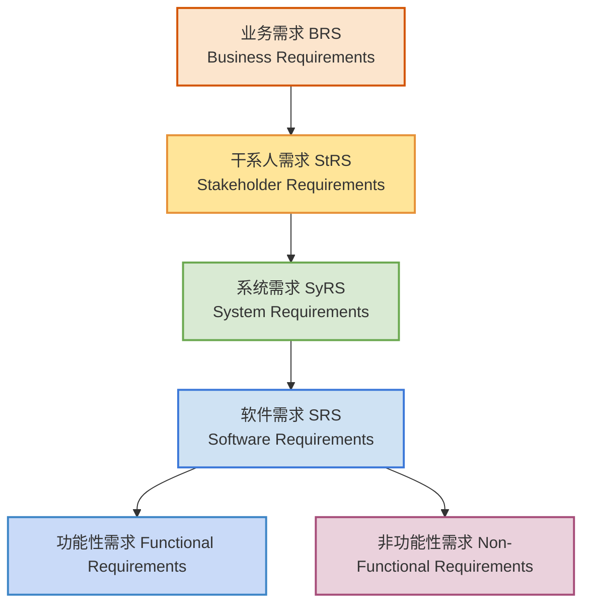

# 定义

**功能性需求（functional requirement）** 是指系统或系统组件必须提供的功能。这类需求规定了系统在输入、行为和输出方面应该做什么，以支持用户目标或满足业务需求。它们通常以 **“系统应能……”（The system shall …）** 的形式来表达，必须是**可验证的**，即能够通过检查、演示、测试等方式确认其实现情况。

案例：  
系统应能在巡检发现异常时，通过短信向配置的运维人员发送通知。

# 功能性需求的来源

在 **ISO/IEC/IEEE 29148:2018** 的框架下，**功能性需求（functional requirements）不是凭空出现的**，而是逐层“推导、分解和分配”出来的。

## 案例

### 业务需求

> 组织或用户的业务目标、商业价值诉求，说的是“为什么要有系统”，不是“系统怎么实现”。

#### 业务目标

用户在使用系统管理监控设备时，录像配置可能会存在遗漏（比如没有配置存储位置，没有配置录像计划），或者可能因为存储设备异常导致没有录像。监控点很多的情况下，人工发现、记录异常非常困难。设计录像巡检功能解决用户人工发现、记录异常非常困难的问题，系统定期检查是否存在录像，不存在录像时向用户推送报警消息、记录异常信息，帮助用户发现和解决录像异常的问题。

#### 安装部署场景

安装部署人员在完成设备添加和录像计划配置后，能立即执行巡检，快速发现异常并修复。当巡检发现异常时，安装部署人员可以通过界面查看详细信息并解决问题。确认异常修复后，安装部署人员执行快速巡检验证修复有效，再执行全盘巡检，确保系统录像功能正常，顺利完成部署。

#### 运维场景

系统能按照定时计划自动巡检，并在发现异常时及时通知运维人员。运维人员可以选择通过短信或邮件接收异常通知，当运维人员收到通知后，会登录系统查看巡检结果，找到问题设备并解决。修复后，运维人员执行快速巡检确认修复有效，再执行全盘巡检确保整体恢复正常。

#### 系统管理员场景

系统管理员能控制哪些用户拥有录像巡检权限，以及配置定时巡检计划的范围和频率，保证系统运维可控、安全。

### 干系人需求

> 业务需求被分解到各类干系人（用户、管理员、监管方等）的视角。说的是 **“用户想要系统做什么”**。

[[条目式用户故事|干系人需求案例]]

### 系统需求

> 干系人需求被转化为系统整体应该具备的能力。说的是 **“系统必须做什么来满足用户需求”**。

[[从用户场景 → 功能模块 → 功能性需求条目”的分解过程|系统需求案例]]

### 软件需求

> 系统需求被进一步分配到软件部分。**功能性需求**就在这里被明确定义

[[功能性需求清单|功能性需求案例]]

# 功能性需求条目/功能性需求项/功能点

## 定义

**功能性需求项**是指经过唯一编号管理的、独立的一条功能性需求语句，它描述了系统或组件必须执行的某个具体功能行为，并且该条目必须是**完整、无歧义、可验证**的。

它有如下特点和要求：
- **唯一性**：每条需求项必须有唯一编号（如 FR-001）。
- **独立性**：一条需求项描述一个需求，不与其他需求混杂。
- **可验证性**：必须能够通过检查、演示或测试来确认其实现。

## 案例

### **正面案例**

**FR-001**: 系统应能支持用户创建录像巡检任务，并允许用户配置以下参数：

1. 巡检范围（IPC列表）；
2. 巡检周期（以天为单位，取值范围 1-365）；
3. 执行时间（24 小时制，精确到分钟）。

当用户保存任务后，系统应能在配置的时间自动触发巡检，并在执行完成后生成巡检报告。

**唯一性**：
- FR-001唯一编号

**独立性：**
- 没有混合其他需求（没有在需求描述中有”FR-002完成后“这样的引用）
- 只描述一个完整的功能性需求

**可验证性**：

- 输入有效的参数，保存任务 → 巡检任务应出现在任务列表。
- 等待至配置的时间 → 系统应自动执行巡检。
- 巡检结束后 → 系统应生成报告文件，可供下载和查看。

### **反面案例**

#### 例 1：不完整

> 系统应能支持录像巡检。

问题：
- 缺乏输入条件（巡检如何配置？）。
- 缺乏处理逻辑（何时执行？）。
- 缺乏输出（执行结果是什么？）。
- 不可验证（测试人员无法判断巡检是否真的按需求执行）。

#### 例 2：有歧义

> 系统应定期对录像进行巡检，并在必要时生成结果。

问题：

- “定期”没有说明周期单位和范围。
- “必要时”没有定义触发条件。
- “结果”不明确（是报告、告警还是日志？）。
- 歧义导致不同人可能理解不同。

#### 例 3：不可验证

> 系统应提供友好的录像巡检功能。

问题：

- “友好”是主观的、不可量化的。
- 无法通过测试用例验证“友好”是否实现。

#### 例 4：独立性反例——依赖其他需求

**FR-011**: 系统应能在 FR-010 提到的巡检完成后，向管理员发送报告邮件。

问题：

- 直接依赖 **FR-010**，读者必须回看 FR-010 才能理解。
- 独立性差，测试时也需要依赖其他需求的执行。

修正：
**FR-011**: 系统应能在录像巡检任务完成后，向管理员发送巡检报告邮件。

例5：独立性反例——混合多个功能

FR-012: 系统应能支持用户手动启动录像巡检，并在巡检失败时自动重试三次并发送告警通知。

问题：

- 这里包含了 **启动巡检**、**失败重试**、**发送告警通知** 三个功能点。
- 一个需求项过于复杂，测试和追踪困难。

修正：

- FR-012a: 系统应能支持用户手动启动一次录像巡检。
- FR-012b: 系统应能在录像巡检失败时，自动重试执行最多三次。
- FR-012c: 系统应能在录像巡检失败且重试后仍未成功时，向管理员发送告警通知。

> [!info] 判断是否混合了多个功能的规则
> - 是否描述了两个完全独立的系统行为？
> 	- 例5 独立性反例中不是同一个功能的自然输出结果，功能独立
> 	- 正面案例FR001虽然用并连接，但是是同一个功能的自然输出结果
> - 是否需要两个不同的触发条件？
> 	- 例5 独立性反例中，自动重试是巡检失败的结果，然而手动启动一次录像巡检可以有成功的路径。
> - 是否需要不同的测试路径覆盖？

