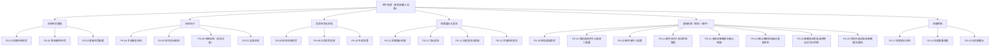

```mermaid
graph TD
    A[用户场景（安装部署 & 运维）]

    A --> M1[巡检任务管理]
    A --> M2[巡检执行]
    A --> M3[异常检测与处理]
    A --> M4[结果展示与报告]
    A --> M5[通知机制（短信 + 邮件）]
    A --> M6[权限控制]

    M1 --> M1_1[FR-01 创建巡检任务]
    M1 --> M1_2[FR-02 修改/删除任务]
    M1 --> M1_3[FR-03 查看任务配置]

    M2 --> M2_1[FR-04 手动触发巡检]
    M2 --> M2_2[FR-05 定时自动巡检]
    M2 --> M2_3[FR-06 快速巡检（异常设备）]
    M2 --> M2_4[FR-07 全盘巡检]

    M3 --> M3_1[FR-08 检测录像异常]
    M3 --> M3_2[FR-09 记录异常信息]
    M3 --> M3_3[FR-10 生成告警]

    M4 --> M4_1[FR-11 界面展示结果]
    M4 --> M4_2[FR-12 导出报告]
    M4 --> M4_3[FR-13 历史查询与筛选]
    M4 --> M4_4[FR-14 生成巡检报告]

    M5 --> M5_1[FR-15 短信通知异常]
    M5 --> M5_2[FR-16 短信通知开关与接收人配置]
    M5 --> M5_3[FR-20 邮件收件人配置]
    M5 --> M5_4[FR-21 邮件收件人验证状态管理]
    M5 --> M5_5[FR-22 未验证邮箱发送确认链接]
    M5 --> M5_6[FR-23 确认链接验证通过更新状态]
    M5 --> M5_7[FR-24 邮箱验证失败或拒绝标记为已拒绝]
    M5 --> M5_8[FR-25 仅向已通过验证邮箱推送通知]

    M6 --> M6_1[FR-17 权限执行巡检]
    M6 --> M6_2[FR-18 权限查看结果]
    M6 --> M6_3[FR-19 无权限提示]

```
